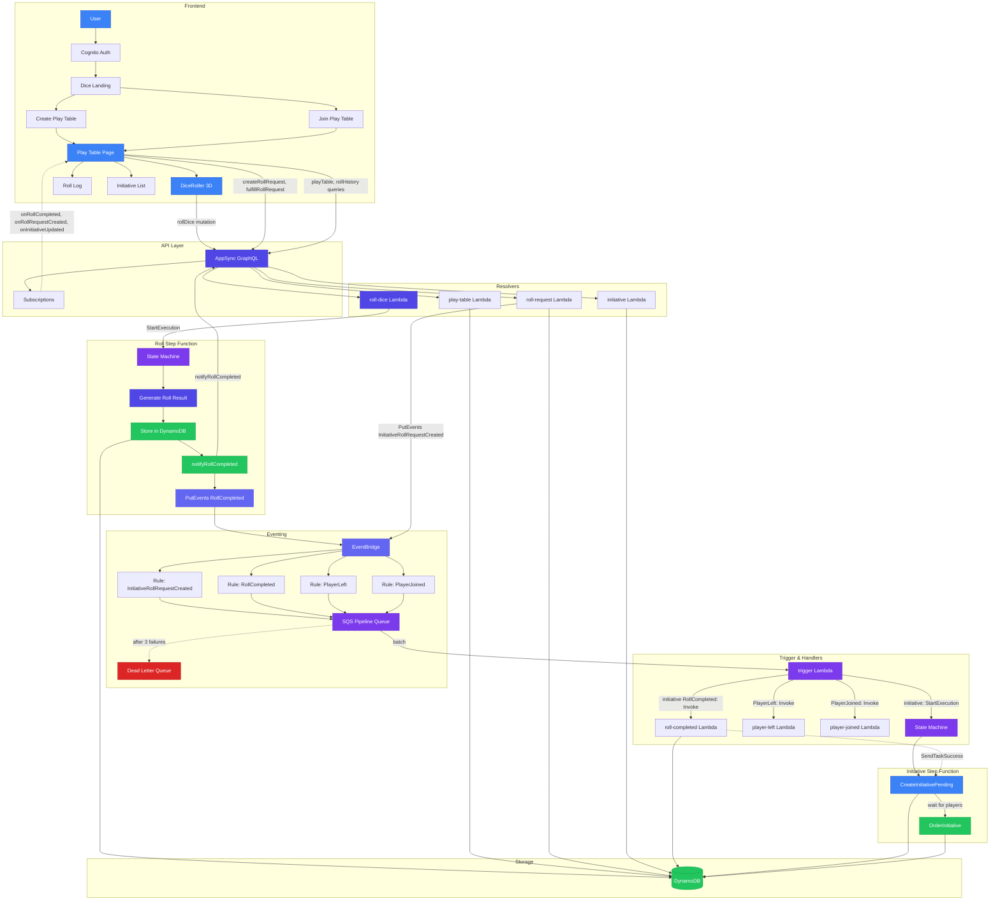
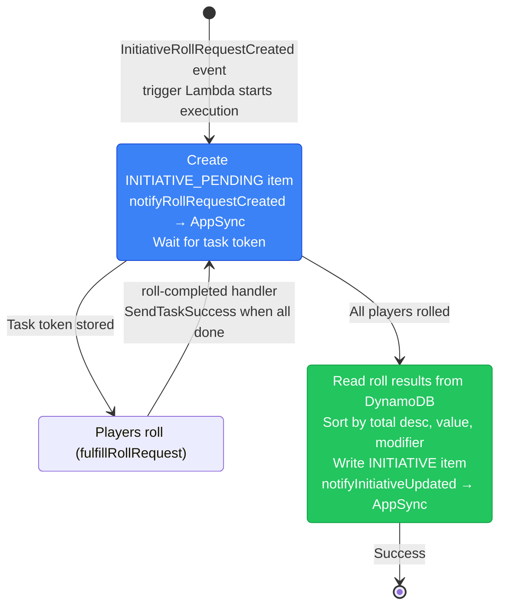

# Architecture & Flow

Visual documentation of the Puzzlebottom's Tabletop Tools Suite application flow. The first tool is the **Dice Roller** — a shared play table where GMs and players roll d20s, with initiative ordering and real-time updates.

**Color scheme:** Gradient along the data flow (blue → indigo → purple → green). Error paths (Fail, DLQ) use red.

## Dice Roller Data Flow (Mermaid)



## Initiative Step Function Detail



## Roll Notification Flow

The subscription is the sole source of truth for roll results in the UI. The `rollDice` and `fulfillRollRequest` mutations return only a minimal acknowledgment (`rollId` + `accepted`), not the roll result. The `rollId` is a correlation token — the client needs it to identify which incoming subscription result belongs to its pending roll.

### Precondition: subscription established at page load

When the PlayTable page mounts, the client subscribes to `onRollCompleted(playTableId)` via WebSocket. AppSync confirms the subscription (`subscription_ack`), and the client is guaranteed to receive all matching events for the lifetime of the connection. The `onRollCompleted` subscription is bound to the `notifyRollCompleted` mutation — not to the user-facing `rollDice`/`fulfillRollRequest` mutations. This subscription is long-lived and predates any roll.

### Per-roll flow

1. Client calls `rollDice` or `fulfillRollRequest` mutation
2. roll-dice Lambda validates the request, generates a `rollId`, starts the Roll Step Function (async), and returns `RollDiceResponse` (`rollId` + `accepted`) — no roll result
3. Client receives `rollId` and stores it as the pending roll to match against incoming subscription results
4. Roll Step Function executes (async, after the Lambda has returned):
   a. Generate roll result (dice values, total, etc.)
   b. Store in DynamoDB
   c. Call `notifyRollCompleted` mutation on AppSync (HTTP + IAM auth) — AppSync responds confirming the mutation was processed, then pushes the `RollResult` to all active subscribers
   d. Publish `RollCompleted` event to EventBridge (inter-module communication — other modules can react to rolls)
5. Subscribed clients receive `RollResult` via `onRollCompleted`, match on `rollId`, and update the UI

The roll-dice Lambda is a thin entry point — it handles validation (play table exists, player is a target, roll request is pending, etc.) and returns the `rollId` immediately. The Step Function handles the ordered pipeline of result generation, storage, and subscriber notification. This guarantees the client has the `rollId` (step 3) before the subscription result arrives (step 5).

EventBridge publication (`RollCompleted` event) is a separate, secondary concern for inter-module communication — not part of the roll notification flow.

## Initiative Roll Request Notification Flow

The `onRollRequestCreated` subscription is the sole source of truth for roll request UI updates. The `createRollRequest` mutation returns the RollRequest to the caller but does not trigger the subscription. Instead, the pipeline triggers it:

1. GM calls `createRollRequest` mutation (Cognito auth)
2. roll-request Lambda creates RollRequest in DynamoDB, publishes `InitiativeRollRequestCreated` to EventBridge, returns RollRequest
3. Trigger Lambda starts Initiative Step Function
4. CreateInitiativePending step: creates INITIATIVE_PENDING, reads RollRequest from DynamoDB, calls `notifyRollRequestCreated` mutation (IAM auth)
5. AppSync pushes to all `onRollRequestCreated` subscribers
6. Players receive the roll request and can fulfill it

This mirrors the roll flow: the pipeline (Step Function) is the source of UI updates via IAM-authed notify mutations. Future ad hoc roll requests will use the same pattern.

## Component Summary

| Component          | Technology              | Responsibility                                                                                                              |
| ------------------ | ----------------------- | --------------------------------------------------------------------------------------------------------------------------- |
| **Frontend**       | React, Vite, Amplify UI | Dice roller UI, Cognito auth, 3D dice (Three.js), GraphQL client                                                            |
| **AppSync**        | AWS AppSync             | GraphQL API, auth (Cognito/API key), real-time subscriptions                                                                |
| **roll-dice**      | Lambda                  | Validate request, generate rollId, start Roll Step Function, return acknowledgment                                          |
| **Roll SF**        | Step Function           | Generate roll result, store in DynamoDB, notify subscribers via `notifyRollCompleted`, publish RollCompleted to EventBridge |
| **play-table**     | Lambda                  | Create/join play tables, leave, query play table and roll history                                                           |
| **roll-request**   | Lambda                  | Create roll requests (ad hoc, initiative), publish to EventBridge                                                           |
| **initiative**     | Lambda                  | clearInitiative, notifyRollRequestCreated, notifyInitiativeUpdated                                                          |
| **EventBridge**    | AWS EventBridge         | Decouple mutations from async processing                                                                                    |
| **SQS**            | AWS SQS                 | Queue for trigger Lambda, DLQ for failures                                                                                  |
| **trigger**        | Lambda                  | Route events: start Step Function or invoke handlers                                                                        |
| **roll-completed** | Lambda                  | Update initiative order when initiative rolls complete                                                                      |
| **Step Function**  | AWS Step Functions      | Orchestrate initiative: CreateInitiativePending → OrderInitiative                                                           |
| **DynamoDB**       | AWS DynamoDB            | PlayTable, Player, Roll, RollRequest, Initiative                                                                            |

## Event Types

| detailType                   | Source                      | Publisher           | Consumer                                   |
| ---------------------------- | --------------------------- | ------------------- | ------------------------------------------ |
| InitiativeRollRequestCreated | puzzlebottom-tabletop-tools | roll-request Lambda | trigger → Step Function                    |
| RollCompleted                | puzzlebottom-tabletop-tools | roll-dice Lambda    | trigger → roll-completed (initiative only) |
| PlayerLeft                   | puzzlebottom-tabletop-tools | play-table Lambda   | trigger → player-left Lambda               |
| PlayerJoined                 | puzzlebottom-tabletop-tools | play-table Lambda   | trigger → player-joined Lambda             |

## Data Shapes

### RollCompleted (roll-dice → EventBridge)

```ts
{
  playTableId: string,
  rollId: string,
  rollRequestId?: string,
  rollRequestType: 'ad_hoc' | 'initiative',
  rollerId: string,
  rollerType: 'gm' | 'player',
  values: number[],
  modifier: number,
  total: number,
  advantage?: string | null,
  dc?: number | null,
  success?: boolean | null
}
```

### InitiativeRollRequestCreated (roll-request → EventBridge)

```ts
{
  playTableId: string,
  rollRequestId: string,
  targetPlayerIds: string[],
  expectedCount: number
}
```

### DynamoDB Items (dice roller)

| Entity            | PK               | SK                   | Description                          |
| ----------------- | ---------------- | -------------------- | ------------------------------------ |
| PlayTable         | `PLAYTABLE#<id>` | `METADATA`           | GM, invite code, createdAt           |
| Player            | `PLAYTABLE#<id>` | `PLAYER#<playerId>`  | characterName, initiativeModifier    |
| Roll              | `PLAYTABLE#<id>` | `ROLL#<rollId>`      | values, modifier, total, visibility  |
| RollRequest       | `PLAYTABLE#<id>` | `ROLLREQUEST#<id>`   | targetPlayerIds, type, dc, advantage |
| Initiative        | `PLAYTABLE#<id>` | `INITIATIVE`         | order: InitiativeEntry[]             |
| InitiativePending | `PLAYTABLE#<id>` | `INITIATIVE_PENDING` | taskToken, expectedPlayerKeys        |
