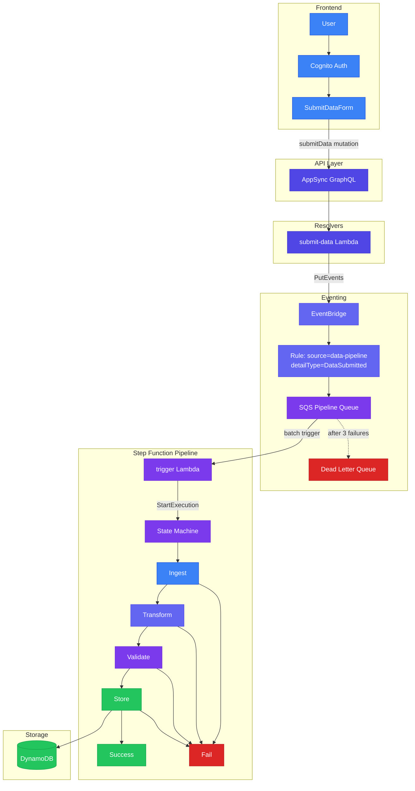
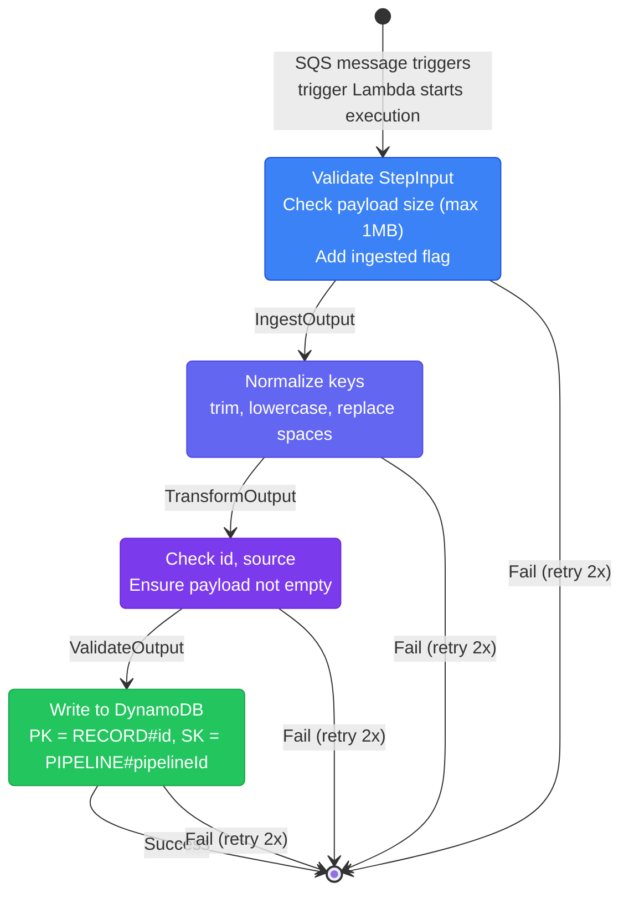

# Architecture & Flow

Visual documentation of the AWS Data Pipeline application flow.

**Color scheme:** Gradient along the data flow (blue → indigo → purple → green). Error paths (Fail, DLQ) use red.

## Detailed Data Flow (Mermaid)



## Step Function Pipeline Detail



## Component Summary

| Component         | Technology              | Responsibility                                              |
| ----------------- | ----------------------- | ----------------------------------------------------------- |
| **Frontend**      | React, Vite, Amplify UI | Submit form, Cognito auth, GraphQL client                   |
| **AppSync**       | AWS AppSync             | GraphQL API, auth (Cognito/IAM), subscriptions              |
| **submit-data**   | Lambda                  | Validate payload, create DataRecord, publish to EventBridge |
| **EventBridge**   | AWS EventBridge         | Decouple submission from processing                         |
| **SQS**           | AWS SQS                 | Queue for pipeline trigger, DLQ for failures                |
| **trigger**       | Lambda                  | Parse SQS, start Step Function execution                    |
| **Step Function** | AWS Step Functions      | Orchestrate Ingest → Transform → Validate → Store           |
| **DynamoDB**      | AWS DynamoDB            | Persist processed records                                   |

## Event & Data Shapes

### DataRecord (submit-data → EventBridge → SQS → trigger)

```ts
{
  id: string,           // UUID
  source: string,       // e.g. "sensor-data"
  payload: object,      // JSON object
  submittedAt: string,  // ISO timestamp
  submittedBy: string   // Cognito sub or "anonymous"
}
```

### StepInput (trigger → Step Function)

```ts
{
  record: DataRecord,
  pipelineId: string,   // UUID for execution
  timestamp: string     // ISO timestamp
}
```

### DynamoDB Item (store output)

| Attribute   | Description                                   |
| ----------- | --------------------------------------------- |
| PK          | `RECORD#<recordId>`                           |
| SK          | `PIPELINE#<pipelineId>`                       |
| GSI1PK      | `SOURCE#<source>`                             |
| GSI1SK      | `submittedAt`                                 |
| payload     | Normalized payload (keys trimmed, lowercased) |
| processedAt | ISO timestamp                                 |
